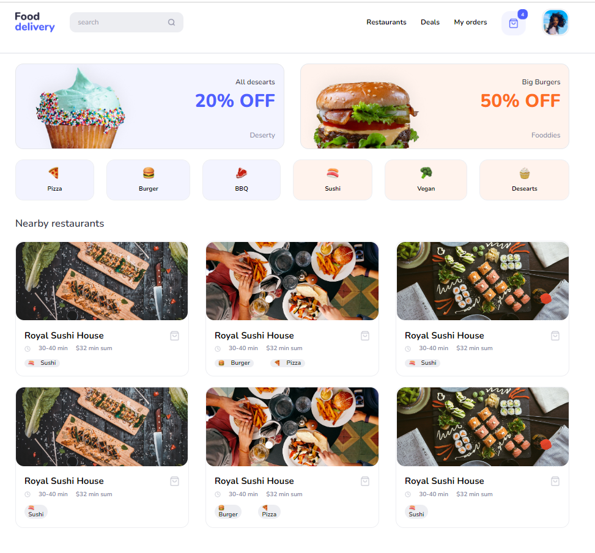

# Food Delivery

This is a fully responsive food delivery website. Users can sign in, search for nearby restaurants, and update their account settings.

Note: It is a static website built in pure HTML/CSS/JS and TailwindCSS.

## Development Setup

1. Run `npm install` to install the dependencies such as lite-server.
2. Run `npm run dev` to launch the website in a browser.